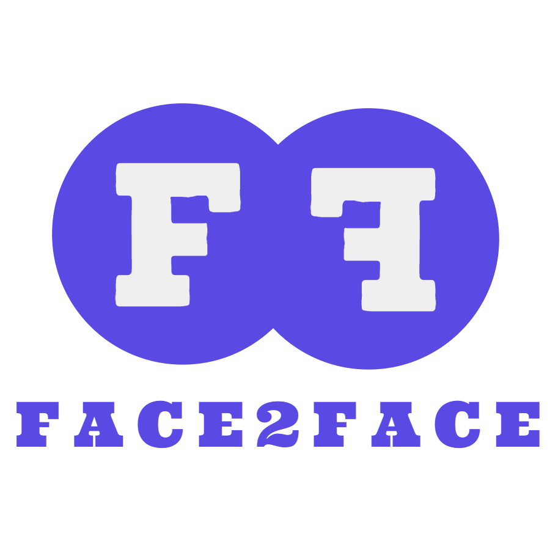

# Face2Face - Aplicação para fazer chamadas de vídeo

 
 

## Resumo

Um projeto pessoal simples feito com o objetivo de possibilitar chamadas de vídeo de uma maneira rápida e prática. Nesta aplicação, feita em cima do Node.js, é possível criar uma sala de vídeo ou ingressar em uma já criada. A biblioteca Socket.IO juntamente com a PeerJS torna possível a comunicação entre os usuários, assim permitindo a transferência de áudio e vídeo entre todos os que estiverem na sala.
 
 
## Como executar

Para executar o projeto na sua máquina basta baixá-lo aqui, entrar na raiz do projeto e executar o comando `npm install` para instalar todas as dependências necessárias para a execução da aplicação (você deve ter o NPM instalado na sua máquina). Após ter instalado, basta usar o comando `npm run dev` para rodar a aplicação. Ela estará disponível em [localhost:3000](http://localhost:3000). A porta 3001 deve estar disponível, pois o servidor de peers roda usando essa porta. Caso queira alterá-la, basta alterar o atributo `port` do `PeerServer` no arquivo server.js e também o atributo `port` da instância `myPeer` no arquivo video-call.js.

#### server.js
    PeerServer({ port: <PORTA_QUE_DESEJAR>, path: '/' });

#### video-call.js
    const myPeer = new Peer(undefined, {
      host: '/',
      port: <PORTA_QUE-DESEJAR>
    });

 

## Informações úteis

- Caso queira fazer uma chamada com outros dispositivos na sua rede, provavelmente será necessário marcar o seu servidor local como um domínio seguro nos navegadores dos outros dispositivos, pois por padrão não é possível habilitar a câmera e o microfone em domínios marcadados como não confiávels. Para isso, basta ativar a flag `#unsafely-treat-insecure-origin-as-secure` para o IP do seu servidor local. Talvez seja necessário incluir a porta, no caso a :3000.
